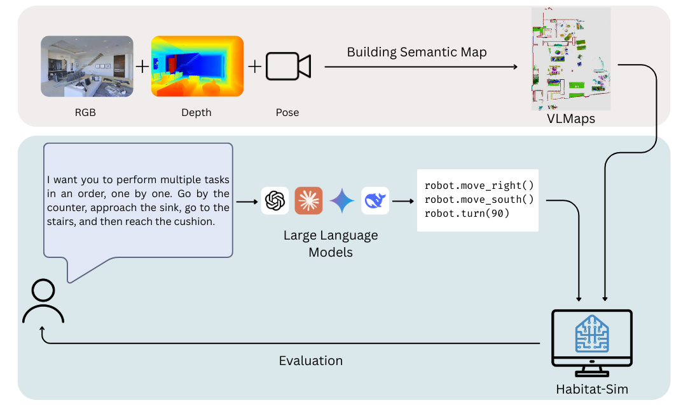

# Benchmarking Large Language Model Reasoning in Indoor Robot Navigation
[](https://opensource.org/licenses/MIT)
[](https://cukurovaai.github.io/Bench-LLM-Nav/)
[](https://emirhanbalci.me/docs/SIU_Poster.pdf)
[](https://youtu.be/ddHJjeE96u8)

[Emirhan Balcı](https://emirhanbalci.me/), [Mehmet Sarıgül](http://mehmetsarigul.com/), [Barış Ata](https://barisata.me/)

This study evaluates the performance of state-of-the-art text-based generative large language models in indoor robot navigation planning, focusing on object, spatial, and common-sense reasoning-centric instructions. Three scenes from the Matterport3D dataset were selected, along with corresponding instruction sequences and routes. Object-labeled semantic maps were generated using the RGB-D images and camera poses of the scenes. The instructions were provided to the models, and the generated robot codes were executed on a mobile robot within the selected scenes. The routes followed by the robot, which detected objects through the semantic map, were recorded. The findings indicate that while the models successfully executed object and spatial-based instructions, some models struggled with those requiring common-sense reasoning. This study aims to contribute to robotics research by providing insights into the navigation planning capabilities of language models.



# Approach

<p align="center">
  
</p>

# Acknowledgment
This repository is primarily built upon [Visual Language Maps (VLMaps)](https://vlmaps.github.io/). We sincerely thank [Huang et al.](https://arxiv.org/pdf/2210.05714) for releasing their work as open-source.

# Installation
> [!IMPORTANT]
> The source code was developed and tested inside a Docker container based on an Ubuntu image to isolate project dependencies. Therefore, the installation steps assume that Docker (version 27.0.3+) and X11 are installed on a Linux machine with an NVIDIA GPU for full compatibility.
> Visual outputs can be displayed via the X11 display protocol.

### Download Matterpot3D Dataset
To create a realistic environment for indoor robot navigation tasks, we leveraged the Matterport3D dataset, comprising high-resolution RGB-D images and 3D reconstructions of real-world indoor spaces. Please check [Dataset Download](https://niessner.github.io/Matterport/), sign the [Terms of Use](http://kaldir.vc.in.tum.de/matterport/MP_TOS.pdf), and send it to the responsible person to request the Matterport3D mesh for use in the Habitat simulator. The return email will attach a Python script to download the data. Copy and paste the script into a file `~/download_mp.py`. 

### Docker Setup :whale2:
Download the `Dockerfile` in the root of this repository and place it in the same directory as the `~/download_mp.py` script. Alternatively, you can copy and paste its contents into a new file named `Dockerfile`. Ensure that the `~/download_mp.py` script is located in the same directory, as it is required during the build process.

Once both files are in place, build the Docker image with:

```bash
# build the docker image
docker build -t "Bench_LLM_Nav" .
```

To run the container with GUI and GPU support, use the following command:

```bash
docker run -it -e DISPLAY=$DISPLAY -v /tmp/.X11-unix:/tmp/.X11-unix -v /home/<your_username>/.Xauthority:/root/.Xauthority --net=host --ipc=host --runtime=nvidia --gpus all Bench_LLM_Nav
```

# Usage

## Generate RGB-D and Pose Data
We used the RGB-D videos and pose information provided for 10 scenes by **VLMaps** in this experiment.

To generate data for the predefined 10 scenes:
```
cd dataset
# Generate RGB-D sequences of Matterport3D scenes with pose information
python generate_dataset.py
```

To generate data beyond the predefined 10 scenes manually:
- Open and edit `config/collect_dataset.yaml`:
	- Set the `scene_names` variable to the desired scene name. (e.g `gTV8FGcVJC9`)

- Then run:
```
cd dataset
python collect_custom_dataset.py
```

The generated data will be stored under a folder named `<scene_name>_<id>` inside `/Bench_LLM_Nav/drive/vlmaps_dataset`. 

## Generate Semantic Map
Follow the commands below to generate the top-down semantic map for a given scene:
```
cd application/semantic
python split_poses.py

# Update the "data_dir" variable to the desired scene name (e.g., 'gTV8FGcVJC9')
python semantic_map.py
```

After generating the semantic map, create the VLMap by running the following commands. This step constructs a 3D map in which each voxel contains the corresponding LSeg embedding.
```
cd ..
python create_map
```

## Set Up LLM API Keys
We focused on evaluating LLMs via API access in this study; thus, running local models is not supported in this project.

To test navigation tasks using LLMs, follow these steps to configure your API key:
1. Obtain an API key ([e.g., from OpenAI](https://platform.openai.com/account/api-keys)) and copy it.
3. Open your `~/.bashrc` file and add the following line: `export LLM_KEY=<your copied key>`
4. Save the file and run `source ~/.bashrc` to apply the changes.

## Set up Navigation Tasks
To initialize the robot in a given scene, we first need to define its starting coordinates.

1. Update the `scene_id` variable in the `config/test_config.yaml` file based on the target scene. (`scene_id` refers to the index of the scene in the `/drive/vlmaps_dataset/` directory)
2. Run the following command to launch an interactive top-down visualization of the selected scene:
```
cd vlmaps/map/
python interactive_map.py
```
3. To specify the robot’s initial pose, first click a point on the map to set its position. Then, click a second point to define its orientation.
The script calculates the transformation matrix (`tf_hab`) based on the two selected positions. Save the resulting `tf_hab` output for future use.

Update the `application/evaluation/llm_prompts.json` file:
1. `task_id` represents the index of the tasks.
2. `scene` update this variable based on the target scene name (e.g., `5LpN3gDmAk7_1`) 
3. `tf_habitat`, update this variable for the target scene based on the collected pose information from the prior steps.
4. `system_prompt`, define a system prompt if the target requires constraints of prior knowledge.
5. `instruction`, define a navigation task based on the scene and the system prompt for the LLM to generate robot code.

Then update the `parse_spatial_goal_instruction()` function in the `vlmaps/utils/llm_utils.py` file to match the API format of the target LLM. By default, the project uses OpenAI models for navigation tasks, as shown below:

```python
openai_key = os.environ["LLM_KEY"]
openai.api_key = openai_key
    
model = "gpt-4o"
results = ""
for lang in instructions_list:
    client = openai.OpenAI(api_key=openai_key)
    response = client.chat.completions.create(
    model=model,
    messages=[
        {"role": "system", "content": system_prompt},
        {"role": "user", "content": lang}],
        max_tokens=300)
```

Finally, run `application/evaluation/test_llms.py` to execute the navigation tasks using LLMs. The output will be saved in the root directory of the repository as:
```
# The structure of the output file looks like this:
root directory
 |-custom_output
 |   |-exp_1
 |   |   |-rgb
 |   |   |   |-frame_0001.png
 |   |   |   |-frame_0002.png
 |   |   |   |-...
 |   |   |-trajectory
 |   |   |   |-path_0.png
 |   |   |   |-path_1.png
 |   |   |   |-...
 |   |   |-map.png
 |   |   |-tasks.txt
 |   |   |-poses.txt
 |   |-exp_2
 ...
```

<p align="center">
  
</p>

## Evaluation
Update the `reference_trajectory_path` and `predicted_trajectory_path` variable in the scripts under the `application/evaluation/` directory to point to the ground-truth and predicted trajectory files.
The script evaluates the alignment between the two trajectories using SDTW, SR, NE, and CLS metrics.

```
cd application/evaluation
# update the path variables of trajectories
python evaluation_metrics.py
```

The reference trajectory can be obtained by manually collecting pose information running the `dataset/collect_custom_dataset.py` script.

```
cd dataset
python collect_custom_dataset.py
```

## Citation

If you find the study or code useful, please cite:

```bibtex
@inproceedings{balci25benchmarking,
          title={Benchmarking Large Language Model Reasoning in Indoor Robot Navigation},
          author={Emirhan Balcı and Mehmet Sarıgül and Barış Ata},
          booktitle = {Proceedings of the 33rd IEEE Conference on Signal Processing and Communications Applications (SIU)},
          year={2025},
          address = {Istanbul, TR}
}
```

## License

MIT License

